# Integrating Angular4 application with VSTS and Azure App Service

This seed project has been created to assist fast tracking some of the issues that can arise when integrating an Angular 4 application with VSTS. This project aims to achieve the following goals:

- setup a Build definition that builds and tests an Angular 4 application
- setup PhantomJS for headless testing as part of Build definition
- publish test results from Karma as part of the Build
- setup Release configuration to Publish this application to an Azure App Service

This project was generated with [Angular CLI](https://github.com/angular/angular-cli) version 1.3.2 and is based on the [Angular Tour of Heroes tutorial](https://angular.io/tutorial)

Please note, this guide is not intended to be an overview of how to create an Angular application. First point of call is to [start here](https://angular.io/guide/quickstart)

## Client Side Routing

In order to get client side routing to work for an application on Azure App Service, we'll need to create a `web.config` file to issue a url redirect. Simply add the below snippet to a `web.config` file to the root of the project. 

For **why** this is required or if you are hosting this application not on an IIS based web server, see [here](https://angular.io/guide/deployment#routed-apps-must-fallback-to-indexhtml)

```xml
<?xml version="1.0" encoding="utf-8"?>
<configuration>
  <system.webServer>
    <rewrite>
      <rules>
        <rule name="AngularJS Routes" stopProcessing="true">
          <match url=".*" />
          <conditions logicalGrouping="MatchAll">
            <add input="{REQUEST_FILENAME}" matchType="IsFile" negate="true" />
            <add input="{REQUEST_FILENAME}" matchType="IsDirectory" negate="true" />
          </conditions>
          <action type="Rewrite" url="/" />
        </rule>
      </rules>
    </rewrite>
  </system.webServer>
</configuration>
```

## Setup PhantomJS Configuration

This section involves the setup and configuration of [PhantomJS](http://phantomjs.org/) which will be used for headless website testing. Credit to [Microsoft's article](https://blogs.msdn.microsoft.com/premier_developer/2017/05/17/integrating-angular-4-unit-tests-with-visual-studio-team-services-vsts/) on setting this up.

* Install Dev Dependancy

  `npm i phantomjs-prebuilt --save-dev`

* Install PhantomJS Karma Launcher

  `npm i karma-phantomjs-launcher --save-dev`
  
* Install JUnit Karma Reporter

  `npm i karma-junit-reporter --save-dev`
  
* Update karma.config.js

  Add `require('karma-phantomjs-launcher')`
  
  Add `require('karma-junit-reporter')`

  Modify browsers configured `browsers: ['PhantomJS']`
  
  Add JUnit to array of reporters `reporters: ['progress', 'kjhtml', 'junit'],`
  
  Setup JUnit Reporter:
  ```
    junitReporter: {
      outputDir: 'testresults', // results will be saved as $outputDir/$browserName.xml
      outputFile: 'test.xml' // if included, results will be saved as $outputDir/$browserName/$outputFile
    },
  ```
  
### Polyfills

In order to get PhantomJS to work with the tests, some polyfills (or JavaScript fallbacks) are required to be enabled. Edit the `polyfills.ts` file in the `src` directory and uncomment the following polyfills.

```ts
 import 'core-js/es6/symbol';
 import 'core-js/es6/object';
 import 'core-js/es6/string';
 import 'core-js/es6/array';
```

## Create VSTS Build Definition

This section involves creating the Build definition in VSTS in order to build the application ready for deployment. Credit to [Seth Reid's article](https://sethreid.co.nz/deploying-angular-cli-project-using-vsts-build-release/) for pointing me to the majority of the grunt work.

* Create a new Empty build process in VSTS

  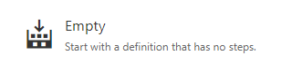

* Click on **Process** and ensure that the **Default agent queue** is set to **Hosted VS2017**. This will help prevent issues later on with PhantomJS and how it resolves the npm dependancy as documented [here](https://github.com/Microsoft/vsts-tasks/issues/1486)

  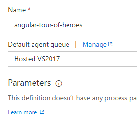

* Set **Get sources** to the location of your repository

* Select **Add Task** and add a new **npm task**. This step will install the npm dependancies of the project.

  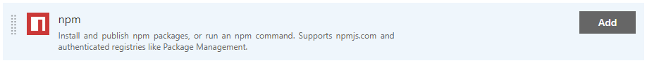

  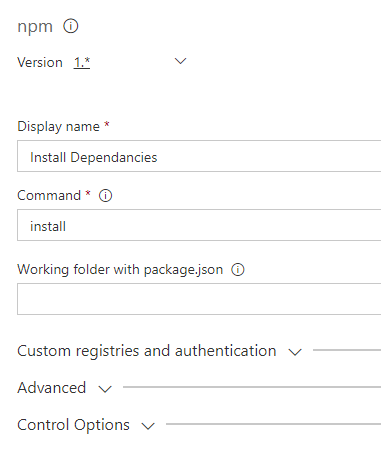

* Select **Add Task** and add a new **npm task**. This step will build the project. We'll execute the npm build command, which is mapped to a ng build as defined in the Angular project.json file.

  Set **Command** to `custom`
  
  Set **Command and arguments** to `run build`
  
  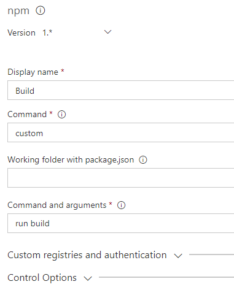

* Select **Add Task** and add a new **npm task**. This step will execute the Karma tests associated with the project.

  Set **Command** to _custom_

  Set **Command and arguments** to `test -- --watch=false --single-run=true --reporters=junit,progress --browsers=PhantomJS`

  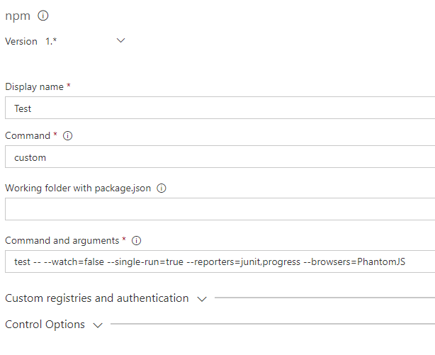

* Select **Add Task** and add a new **Publish Test Results task**. This step will publish the JUnit formatted test results from the Karma execution.

  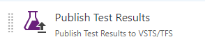

  Set **Test result format** to `JUnit`
  
  Set **Test results files** to `testresults\**\test.xml`

  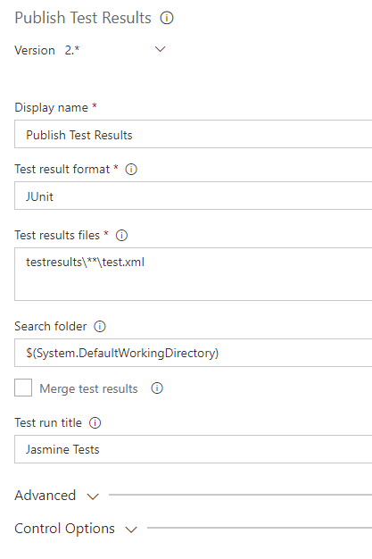

* In order to enable client side routing on the Azure App Service, we'll need to copy the web.config file into the distribution folder for packaging. [Client Side Routing](#client-side-routing)

  Select **Add Task** and add a new **Copy Files**

  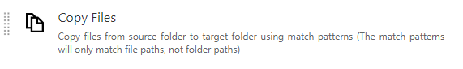

  Set **Contents** to `web.config`
  
  Set **Target Folder** to `dist`

  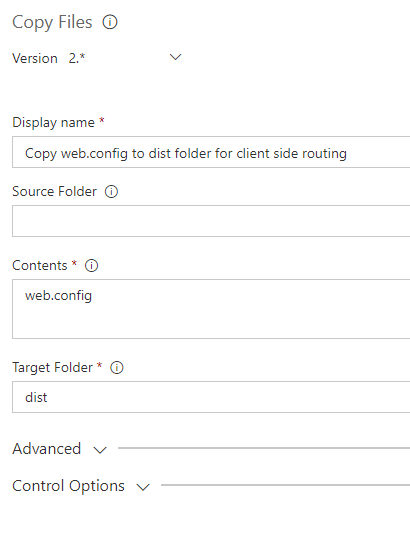

* Select **Add Task** and add a new **Archive Files**. This step will bundle up the files from the `/dist` folder into a zip, ready for publishing into the Release pipeline.

  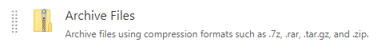

  Set **Root folder (or file)** to `archive`
  
  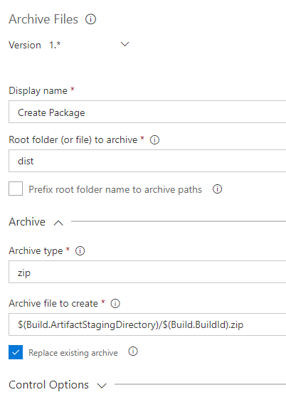

* Select **Add Task** and add a new **Publish Build Artifacts**. This step will publish the package that was just created as a build artifact. This will then be consumed by the Release definition that we shall create.

  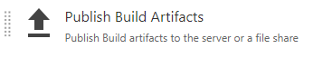

  Set **Path to Publish** to `$(Build.ArtifactStagingDirectory)/$(Build.BuildId).zip`
  
  Set **Artifact Name** to `drop`

  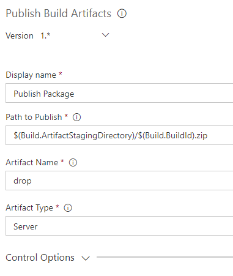
  
 * `Save and Queue` the build and you should be able to see your build pass and test results published out
 
  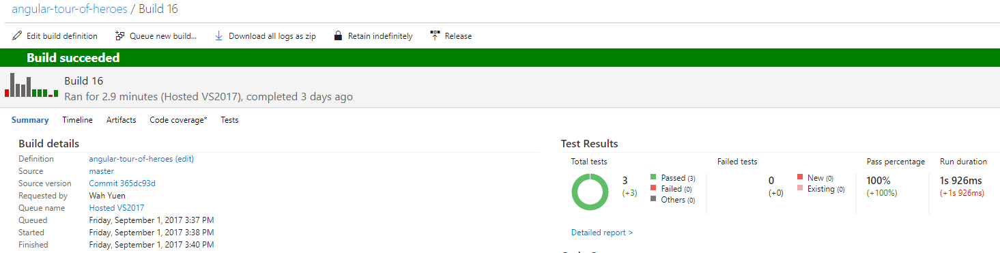

## Create VSTS Release Definition

The final section is to create a release definition that defines how we release this application to Azure. The assumption here is that you will have defined an Azure App Service instance already.

* Create new release definition and select the `Azure App Service Deployment` template

  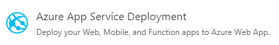

* Click `Add artifact` and configure the options to point to your Build project

  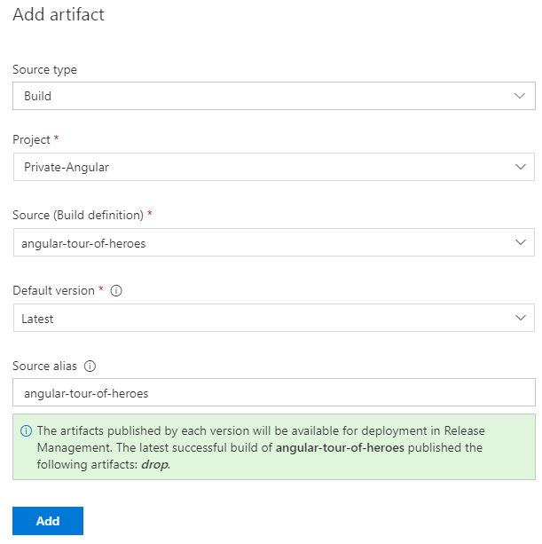

* Click on the `Continuous deployment trigger` (Lightning icon)

  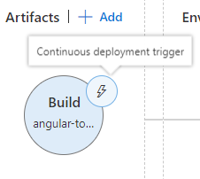

  Set the trigger to be `Enabled`
  
  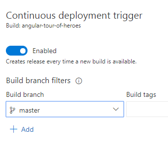
  
* Click on the **Tasks** submenu and select the **Deploy Azure App Service** task

  Select your **Azure subscription** and your **App Service name**
  
  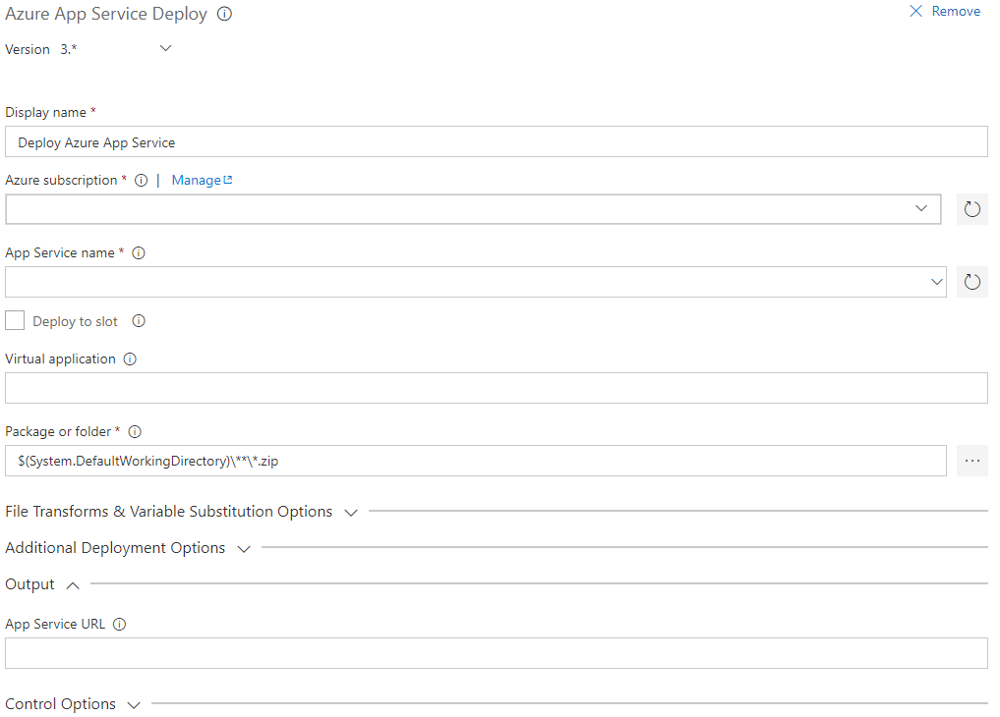
  
* Click Save and create a Release
  
  Your release pipeline is now configured and every time a commit is made, a build will be triggered and automatically deployed to your development environment.
  
  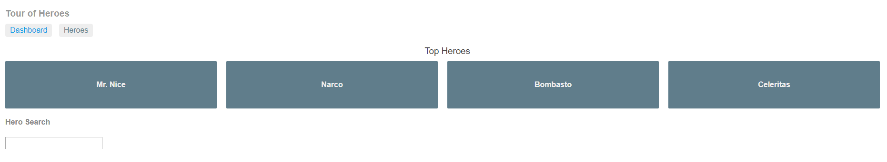
